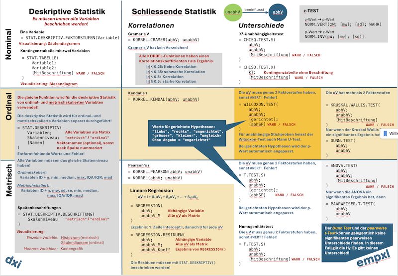

# empxl - Macro-free Empirical Excel Functions

A collection of statistical tests written using pure Excel functions

## Rationale

This collection of pure Excel functions aims at students and practitioners who want to use basic statistical tests in excel.

This project aims at a macro-free set of basic functions using only Excel core features without python, extensions or VBA macros.
This allows this template to be used in security sensitive environments.

## How to use

1. Download a release version of `empxl.xltx`
2. Create a fresh worksheet from the empxl-template `empxl.xltx`
3. Import your data
4. Use the functions

## Implemented Features

- Matrix and vector convinience functions 
- LAMBDA-safe group functions
- Cleanup and datawrangling functions
- Descriptive statistics
- Basic inference statistics for data vectors (t-Test, F-Test, ANOVA, etc.)
- Ordinal scale statistics (Wilcoxon-Test, Kruskal-Wallis-Test, Dunn-Test)
- p-Value Adjustment Function for grouped measures (used in pairwise tests)

## Build manually 

Building manually requires the [EXCEL Advanced Formula Environment (AFE)](https://www.microsoft.com/en-us/garage/blog/2022/03/a-new-way-to-author-and-share-excel-named-formulas-advanced-formula-environment-a-microsoft-garage-project/) installed with the Excel Instance that is used to to build the template. When using the template, AFE is **not** required.

**Important:** Currently, the code builds on the German Naming of Excel formula. Therefore, **Building the template manually requires Excel's German edition**. This will change in one of the upcomin editions.

**Important:** It is not recommended, to use the formula in the `src` folder directly. Because these formula are indented, the extra whitespace cause Excel to misbehave.

1. Run the `bin/compile.sh` script to strip extra whitespaces from the source formulas. This creates a `compile`-folder with clean versions of the formula.
2. Open a fresh Excel workbook. 
3. Save the workbook as an Excel template (`.xlst`)
4. Open AFE
5. Open the Modules-Tab
6. Paste the content of `empxl.afe` into the Workbook-Module. 
7. Save the template for release. 
